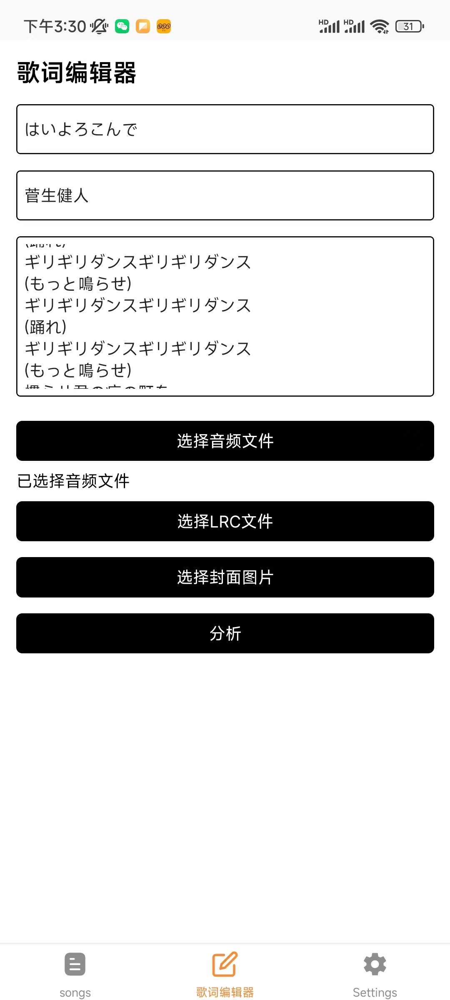
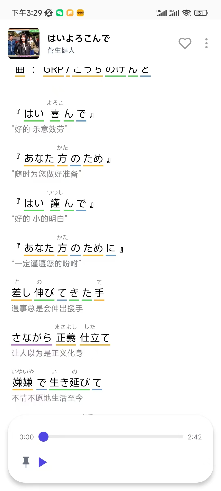

# Furigana lyrics

与Anthony Fu的项目撞车，已经暂停维护。

一款面向日音爱好者的音乐 APP， 核心特色为支持假名标注和语法分析、歌曲练习。

## 预览

  
  

## 技术栈

- React Native
- TypeScript
- React Query
- React Native Track Player
- Kuromoji.js

## 获取

目前仅支持安卓，iOS正在适配中。可以从Releases下载APK安装包进行体验。
